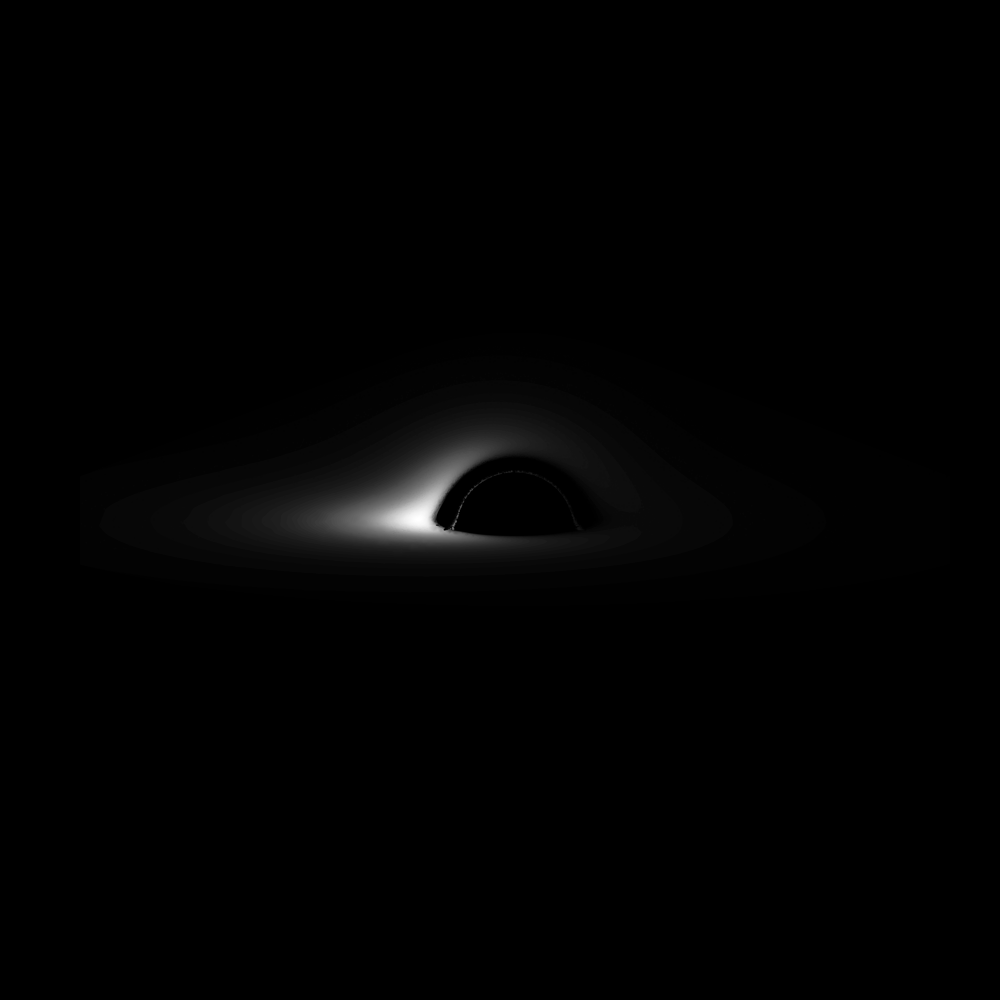

# Luminet
This repo provides material for recreating the famous paper by Jean-Pierre Luminet, simulating the first image of a black hole. This is done in Python 3.8
<table><tr>
<td>  </td>
<td>  </td>
</tr></table>


# Usage

```python
from black_hole import *

M = 1.
bh = BlackHole(inclination=80, mass=M)

# Calculate single isoradial
ir = Isoradial(R=30 * M, incl=80 * np.pi / 180, mass=M, order=0)
ir.calculate()
ir.plotRedshift()  # plot its redshifts along the line

# plot isoradial lines
bh.plotIsoradials([6, 10, 20, 30], [6, 10, 20, 30])

# write frames for a gif of rotating isoradial lines
bh.writeFrames(direct_r=[6, 10, 20, 30], ghost_r=[6, 10, 20, 30], start=0, end=180, step_size=5,
               ax_lim=(-35, 35))

# plot lines of equal redshift values
bh.plotIsoRedshifts(minR=5, maxR=80, r_precision=20, midpoint_steps=5,
                    redshifts=[-.5, -.35, -.15, 0., .15, .25, .5, .75, 1.])
```

# Latest updates:
Rewrite of entire branch. Apologies for the lack of incremental updates, it seems my upstream branch has not been set up properly. This is fixed now.
Everything has been moved to two files: black_hole_math.py (for calculating equations and variables) and a file containing the class 
BlackHole() for easy access to calculations.

Vastly improved speed and stability. Impact parameters are calculated using the midpoint method: stable and quick.
Added functionality to calculate redshifts and isoredshift lines

(30/12/2021)
- Identified errors in the paper. This explains the large redshift values. Fixed these errors and annotated them in the code.
- Added functionality to plot over the original figure to check for these errors (only the figure of isoradial lines at incl=60°)

(24/2/2022)
- Fixed redshift
- Can now sample points in (R, alpha) space. Luminet started from the isofluxlines though, which may be (will probably be) more efficient.

# TODO

1. Flux
  - Calculate isofluxlines in some efficiënt manner (can now be reconstructed from sampled points, but it would be neat to sample points based on isofluxlines). Perhaps calulating some points and reconstructing the lines?

2. Redshift
- Finish implementation of Redshift class. Finish algorithm to calculate tip of closing redshift curves with midpoints method. Finish calculating between known solutions to improve isoredshift lines.
