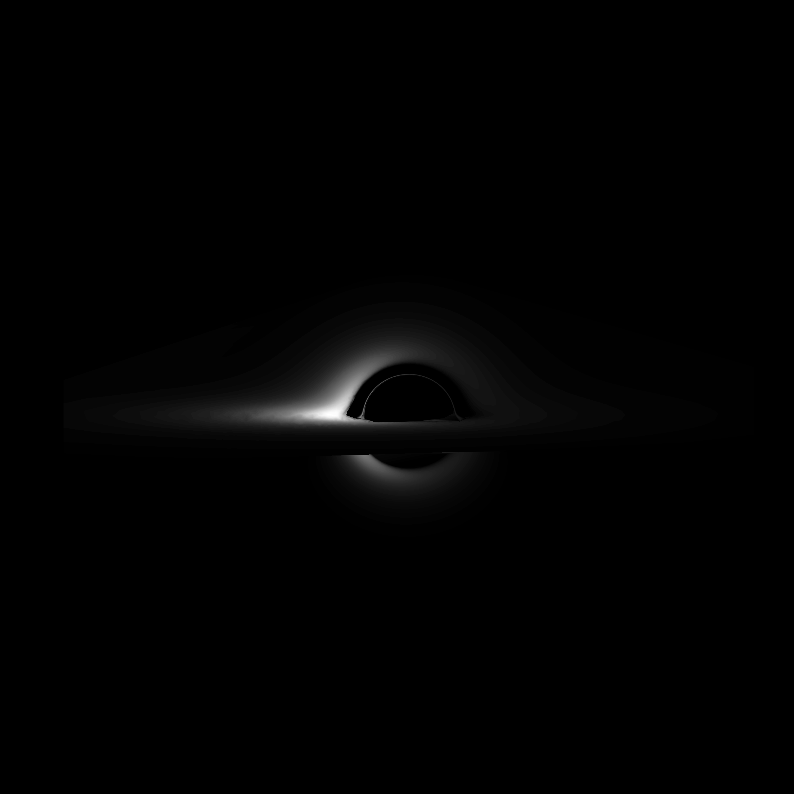

<div align="center">
  
# Luminet
    
  
This repo provides material for recreating the famous paper by Jean-Pierre Luminet (1979), simulating the first image of a black hole. This is done in Python 3.8

</div>



# Usage

```python
from black_hole import *

M = 1.

############ The Isoradial class ############
# Calculate single isoradial
ir = Isoradial(radius=30*M, incl=80 * np.pi / 180, bh_mass=M, order=0)
ir.calculate()
ir.plot_redshift()  # plot its redshifts along the line

############ The BlackHole class ############
bh = BlackHole(inclination=85, mass=M)

## Plot isoradial lines. Plotting 1 Isoradial is equivalent to the above method
bh.plot_isoradials([10, 20, 30], [10, 20, 30])

## Plot Isoredshift lines
bh.plot_isoredshifts(redshifts=[-.5, -.35, -.15, 0., .15, .25, .5, .75, 1.])
# This method fails for extreme inclinations i.e. edge-on and top-down

## Sample points on the accretion disk and plot them
bh.sample_points(n_points=20000)
bh.plot_points()
# Plot isoredshift lines from the sampled points (useful for edge-on or top-down view, where the other method fails)
bh.plot_isoredshifts_from_points()
```

# Latest updates:
24 February, 2022
- Fixed redshift
- Can now sample points in (R, alpha) space. Luminet started from the isofluxlines though, which may be (will probably be) more efficient.

20 May, 2022 
- changed from mpmath library to scipy for the calculation of elliptic integrals. 
- main method of calculating isoredshifts is now done by sampling the entire accretion disk space and making a contour plot of the resulting points.  
- added gif of rotating isoredshift values for varying inclination. 

4 June, 2022
- implemeted accretion disk size. Now the black hole photograph can be plotted including the ghost image
- Fixed the Isoredshift algorithm. You can now calculate isoredshift lines with arbitrary precision. This method fails for edge-on or top-down inclinations (0, 90 or 180 degrees) as the isoradials and isoredshift lines don't intersect at these inclinations.
- Moved most parameters to a separate file: `paremeters.ini`
# TODO

## Bugs
- Fix plotting from points when inclination is over 90 degrees

## Improvements

- Calculate isofluxlines in some efficiënt manner (can now be reconstructed from sampled points, but it would be neat to sample points based on isofluxlines). Perhaps calulating some points and reconstructing the lines?
- clean up class structure. The BlackHole class does not need to contain the solver/plotting parameters of isorefshifts or isoradials. These could (and should ?) be split up. 
- implement data classes?
- add isoredshift ghost image plotting 
- add video of rotating black hole
- Kerr metric? 


# Bibliography
[1] Luminet, J.-P., [“Image of a spherical black hole with thin accretion disk.”](https://ui.adsabs.harvard.edu/abs/1979A%26A....75..228L/abstract), <i>Astronomy and Astrophysics</i>, vol. 75, pp. 228–235, 1979.

[2] J.-P. Luminet, [“An Illustrated History of Black Hole Imaging : Personal Recollections (1972-2002).”](https://arxiv.org/abs/1902.11196) arXiv, 2019. doi: 10.48550/ARXIV.1902.11196. 
